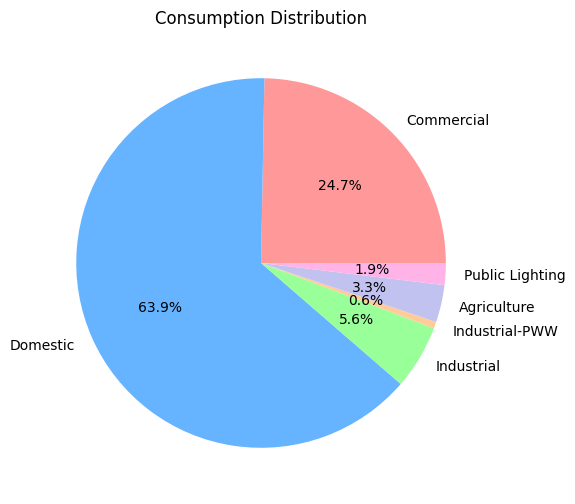
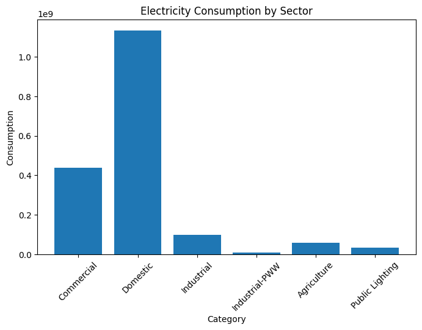

# Kerala Electricity Consumption Analysis

This project analyzes electricity consumption across different sectors in Kerala using Python and data visualization techniques.

## Technologies Used
- Python
- Pandas
- Matplotlib
- Google Colab

## Features
- Electricity consumption analysis
- Percentage calculation
- Bar chart visualization
- Pie chart visualization
- Data insights generation

## Dataset
Dataset Source: Kerala State Electricity Board (KSEB) public statistics.

## Key Insights
- Domestic sector consumes the highest electricity
- Commercial sector is the second highest contributor
- Industrial and agriculture sectors contribute comparatively less
- Public lighting has the lowest electricity consumption

## Visualizations

### Electricity Consumption Distribution

### Electricity Consumption by Sector

